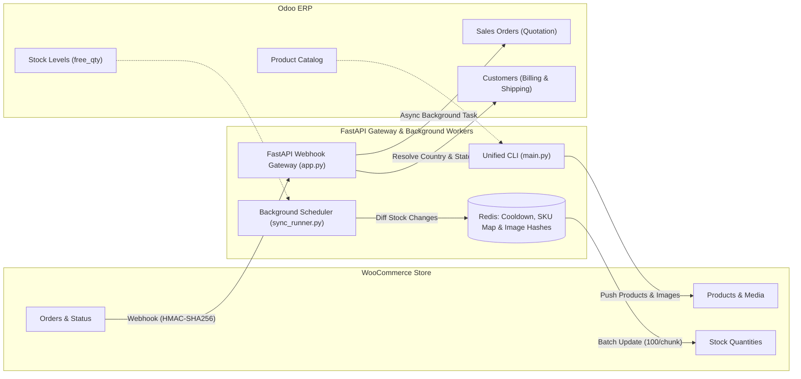

# Odoo <-> WooCommerce Sync Gateway

[](https://www.python.org/)
[](https://fastapi.tiangolo.com/)
[](https://redis.io/)
[](https://woocommerce.github.io/woocommerce-rest-api-docs/)
[](https://www.odoo.com/)

A high-performance, resilient, bidirectional synchronization middleware connecting **Odoo ERP** and **WooCommerce**.

Designed for enterprise reliability, resource efficiency, and financial accuracy, this service handles real-time webhooks, inventory diffing, media deduplication, order lifecycle changes, and scheduled reconciliation.

---

## Architecture Overview



---

## Key Features

### 1. Reliable Order Synchronization (WooCommerce $\to$ Odoo)
* **Financial Accuracy:** Line items, unit prices, dynamic shipping charges (as an Odoo `DELIVERY` service product), and additional fees are fully captured.
* **Smart Customer Resolution:** Resolves billing details, maps ISO country codes to `res.country`, and maps states to `res.country.state`. If the shipping address differs, it automatically generates a child delivery contact (`partner_shipping_id`).
* **Order Lifecycle & Cancellations:** Handles `order.updated` and status change hooks:
  * If an order is marked `cancelled` in WooCommerce, the Odoo quotation is automatically cancelled (`action_cancel`). If already confirmed, an urgent alert is posted to the chatter.
  * Captures `refunded` and `completed` events with audit logs in the order chatter.
* **Audit Trail:** Injects WooCommerce order ID, direct admin URL, payment method title, and transaction ID directly into the Odoo chatter.
* **Self-Healing Reconciliation:** Built-in polling worker queries recent orders to catch any webhooks missed during network blips or server restarts.

### 2. Intelligent Product Synchronization (Odoo $\to$ WooCommerce)
* **Storable vs. Service Items:** Storable goods (`type="product"`) are configured with active inventory management (`manage_stock=True`), while services and consumables have stock tracking disabled.
* **Media Deduplication:** Decodes and computes an MD5 checksum of Odoo product images. Unchanged images are **never re-uploaded**, preventing WordPress media library clutter.
* **Category Caching:** Caches category hierarchies in-memory to eliminate redundant HTTP GET lookups.
* **Text Sanitization:** Cleans illegal XML-RPC control characters and normalizes HTML descriptions.

### 3. High-Scale Stock Synchronization (Odoo $\to$ WooCommerce)
* **Full Catalog Pagination:** Paginates through all Odoo products in chunks of 200, bypassing arbitrary query limit caps.
* **Redis SKU Map Cache:** Caches the entire WooCommerce catalog SKU $\to$ ID mapping in Redis for 1 hour, saving 50+ HTTP requests every sync cycle.
* **Changed-Only Diffing:** Compares current stock against the last pushed quantities in Redis; idle cycles generate **0 writes** to WooCommerce.
* **Batch REST Writes:** Groups stock updates into batches of 100 products per request.

### 4. Enterprise Safety & Performance
* **Fast Webhook ACKs:** Webhooks immediately respond with `202 Accepted` and offload heavy execution to background worker threads, preventing WooCommerce webhook timeouts.
* **Distributed Cooldowns:** Atomic Redis locks prevent rapid redeliveries and worker race conditions.
* **Connection Pooling & Exponential Backoff:** Reusable HTTP sessions equipped with `urllib3.util.Retry` handle transient network errors (429, 500, 502, 503, 504).
* **Lazy Odoo Connection:** Gracefully recovers from expired Odoo sessions and never crashes the web server on startup if Odoo is temporarily restarting.

---

## Project Structure

```text
odoo-woocommerce/
├── app.py                  # FastAPI webhook gateway, health probes & manual sync API
├── config.py               # Central environment configuration & HTTP timeouts
├── cooldown.py             # Redis-backed distributed lock & deduplication
├── main.py                 # Unified CLI command runner (products, orders, stock, server)
├── odoo_client.py          # Odoo XML-RPC client with auto-reconnect, pagination & helpers
├── order_sync.py           # Order import, financial line mapping, status updates & reconciliation
├── product_sync.py         # Product template mapping, category resolution & image sync
├── stock_sync.py           # Periodic inventory diffing & batch stock updates
├── sync_runner.py          # Unified background daemon (stock sync + order reconciliation)
├── utils.py                # String sanitization, safe numeric parsers & MD5 hashing
├── woocommerce_client.py   # WooCommerce REST & WP Media client with retry & caching
├── test_odoo.py            # Diagnostic script: test Odoo product connectivity
├── test_odoo_stock.py      # Diagnostic script: test Odoo stock & inventory fields
├── requirements.txt        # Python package dependencies
├── .env.example            # Environment configuration template
└── README.md               # Project documentation
```

---

## Getting Started

### Prerequisites
* **Python 3.10+**
* **Redis Server** (v5.0+) running locally or accessible via network
* **Odoo** (v14, v15, v16, v17, or v18) with XML-RPC enabled
* **WooCommerce** (v7.0+) with REST API enabled and WordPress Application Passwords

### 1. Installation
Clone the repository and set up a virtual environment:

```bash
git clone https://github.com/your-username/odoo-woocommerce.git
cd odoo-woocommerce

python -m venv .venv

# On Linux/macOS:
source .venv/bin/activate
# On Windows (PowerShell):
.venv\Scripts\Activate.ps1

pip install -r requirements.txt
```

### 2. Environment Configuration
Copy the template and fill in your credentials:

```bash
cp .env.example .env
```

Edit `.env` with your settings:

```dotenv
# --- Odoo ---
ODOO_URL=https://your-odoo-instance.com
ODOO_DB=your_database_name
ODOO_USERNAME=your_user@email.com
ODOO_PASSWORD=your_api_key_or_password

# --- WooCommerce ---
WC_URL=https://your-store.com
WC_CONSUMER_KEY=ck_xxxxxxxxxxxxxxxxxxxxxxxxxxxxxxxxxxxxxxxx
WC_CONSUMER_SECRET=cs_xxxxxxxxxxxxxxxxxxxxxxxxxxxxxxxxxxxxxxxx

# --- WordPress Media (Images) ---
WP_USERNAME=your_wp_username
WP_APP_PASSWORD=xxxx xxxx xxxx xxxx xxxx xxxx

# --- Redis ---
REDIS_URL=redis://localhost:6379/0

# --- Webhook Security ---
WC_WEBHOOK_SECRET=your_secret_from_woocommerce_settings
ODOO_WEBHOOK_SECRET=your_custom_shared_secret
```

---

## Running the Services

### 1. Unified CLI Tool (`main.py`)
Use `main.py` to trigger individual operations or run diagnostics:

```bash
# Display CLI help
python main.py --help

# Sync a single product by SKU
python main.py product --sku sf-5

# Sync a single product by Odoo record ID
python main.py product --id 123

# Bulk sync products (with limit and offset)
python main.py product --all --limit 50 --offset 0

# Import a single WooCommerce order by ID
python main.py order --id 8387

# Run a single stock sync cycle
python main.py stock --once

# Force refresh WooCommerce SKU map and sync stock
python main.py stock --refresh-cache

# Reconcile orders modified in the last 24 hours
python main.py reconcile --hours 24

# Launch the FastAPI webhook server
python main.py server --host 0.0.0.0 --port 8000
```

### 2. FastAPI Webhook Server (`app.py`)
Run the webhook receiver in production:

```bash
uvicorn app:app --host 0.0.0.0 --port 8000 --workers 4
```

### 3. Background Sync Daemon (`sync_runner.py`)
Run the background scheduler to periodically sync stock and reconcile missed orders:

```bash
python sync_runner.py
```
* **Stock Sync:** Runs every `STOCK_SYNC_INTERVAL_SECONDS` (default: 15 minutes).
* **Order Reconciliation:** Runs every `ORDER_RECONCILE_INTERVAL_SECONDS` (default: 1 hour).

---

## Webhook Setup Guide

### 1. WooCommerce $\to$ Odoo (Orders)
1. In WordPress Admin, navigate to **WooCommerce $\to$ Settings $\to$ Advanced $\to$ Webhooks**.
2. Click **Add webhook**:
   * **Name:** `Odoo Order Import`
   * **Status:** `Active`
   * **Topic:** `Order created` (and optionally create a second one for `Order updated`)
   * **Delivery URL:** `https://your-middleware-domain.com/webhook/woocommerce-order`
   * **Secret:** Enter the same string configured in `WC_WEBHOOK_SECRET`.
   * **API Version:** `WP REST API Integration v3`
3. Save the webhook.

### 2. Odoo $\to$ WooCommerce (Products)
Configure an **Automated Action** (or Webhook in Odoo 17/18) on `product.template`:
* **Model:** `Product Template`
* **Trigger:** `On Update` or `On Save`
* **Action:** Send Webhook (POST)
* **Target URL:** `https://your-middleware-domain.com/webhook/odoo/product-updated`
* **Header / Parameter:** Send `X-Odoo-Secret: <your_secret>` or `?secret=<your_secret>`.
* **Payload:**
  ```json
  { "id": 123 }
  ```

---

## API Endpoints Reference

| Method | Endpoint | Description |
| :--- | :--- | :--- |
| `GET` | `/` | Root health ping |
| `GET` | `/health` | Probes connectivity to Redis, Odoo, and WooCommerce |
| `POST` | `/webhook/odoo/product-updated` | Ingests product change event from Odoo |
| `POST` | `/webhook/woocommerce-order` | Ingests order creation/status update event from WooCommerce |
| `POST` | `/sync/products` | Triggers background bulk product sync |
| `POST` | `/sync/stock` | Triggers background stock synchronization |
| `POST` | `/sync/orders/reconcile` | Triggers background order reconciliation |

---

## Production Deployment (systemd Example)

To deploy the services as systemd daemons on Ubuntu/Debian:

### Webhook API Service (`/etc/systemd/system/odoo-wc-api.service`)
```ini
[Unit]
Description=Odoo WooCommerce FastAPI Gateway
After=network.target redis-server.service

[Service]
Type=simple
User=ubuntu
WorkingDirectory=/opt/odoo-woocommerce
ExecStart=/opt/odoo-woocommerce/.venv/bin/uvicorn app:app --host 0.0.0.0 --port 8000 --workers 2
Restart=always
RestartSec=5

[Install]
WantedBy=multi-user.target
```

### Background Runner Service (`/etc/systemd/system/odoo-wc-runner.service`)
```ini
[Unit]
Description=Odoo WooCommerce Sync Scheduler
After=network.target redis-server.service

[Service]
Type=simple
User=ubuntu
WorkingDirectory=/opt/odoo-woocommerce
ExecStart=/opt/odoo-woocommerce/.venv/bin/python sync_runner.py
Restart=always
RestartSec=10

[Install]
WantedBy=multi-user.target
```

Enable and start services:
```bash
sudo systemctl daemon-reload
sudo systemctl enable --now odoo-wc-api odoo-wc-runner
```

---

## Diagnostics & Testing

Verify connections individually:

```bash
# Test Odoo connection and read 10 products:
python test_odoo.py

# Test Odoo stock quants (qty_available, free_qty):
python test_odoo_stock.py

# Query WooCommerce system status and version:
python -c "from woocommerce_client import wc_get; print(wc_get('/wp-json/wc/v3/system_status'))"
```

---

## License
Distributed under the MIT License. See `LICENSE` for more information.
